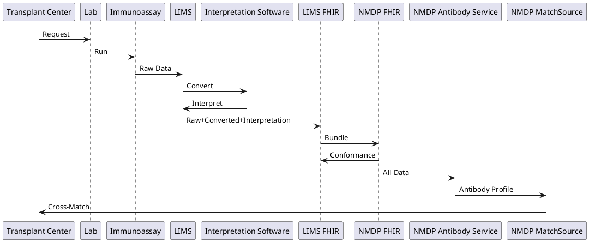
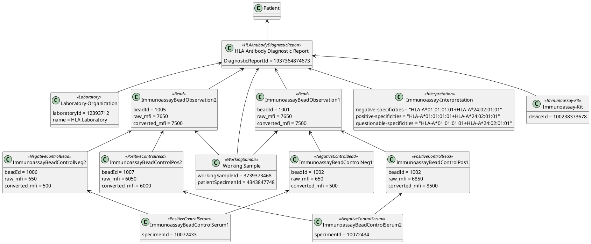

<!-- Graphic-style Header -->

  

<!-- Graphic-style Header -->

  

<h1 align="center">HLA Antibody Diagnostic Report FHIR Implementation Guide</h1>

  <i>A consolidated laboratory report based on the work of the <a href="https://github.com/immunomath/haml">HAML Working Group</a></i>

---

# HLA Antibody Reporting
FHIR standard documents for the electronic exchange of HLA antibody reports
Based on the HAML working group specification, version 0_4_4

FHIR Project: [FHIR HLA Antibody Diagnostic Report](https://simplifier.net/hla-antibody-report)

FHIR Implementation Guide: [FHIR HLA Antibody Diagnostic Report IG](https://simplifier.net/guide/hla-antibody-report-ig?version=current)

HAML Repository: [HAML HLA Antibody Markup Language](https://github.com/immunomath/haml)

---

## FHIR Repository Structure

hla-antibody-report
├── input
│   ├── fsh/              # FHIR Shorthand (FSH) source files (if used)
│   ├── resources/        # FHIR resources (StructureDefinitions, ValueSets, CodeSystems, etc.)
│   │   ├── StructureDefinition/
│   │   │   └──  your-profile-name.json  (or .xml)
│   │   ├── ValueSet/
│   │   │   └──  your-valueset-name.json  (or .xml)
│   │   └── CodeSystem/
│   │       └──  your-codesystem-name.json  (or .xml)
│   ├── images/           # Images for documentation
│   ├── pages/            # Markdown or HTML pages for your implementation guide
│   │   └── index.md
│   └──  package-list.json # Metadata for the FHIR package
├── output/               #  Generated Implementation Guide (after building)
├── .github/              # GitHub-specific files (e.g., CI/CD workflows)
├── package.json         # Project metadata (for SUSHI/IG publisher)
├── sushi-config.yaml    # SUSHI configuration file (if using FSH)
├── README.md            # Repository README
├── LICENSE              # Project license
└── TRADEMARKS           # Project trademark attributions

---

## Dependencies

| Name                         | Version         | Release Date |
|------------------------------|-----------------|--------------|
| hl7.fhir.r4.core             | 4.0.1           | 11/18/2019   |
| hl7.fhir.us.core             | 8.0.0           | 6/11/2025    |
| hl7.terminology.r4           | 6.4.0           | 5/29/2025    |
| hl7.fhir.uv.extensions.r4    | 5.2.0           | 2/11/2025    |
| hl7.fhir.us.core             | 8.0.0           | 6/11/2025    |
| hl7.fhir.us.core             | 8.0.0           | 6/11/2025    |
| hl7.fhir.uv.smart-app-launch | 2.2.0           | 7/29/2024    |
| hl7.fhir.uv.extensions       | 5.1.0-snapshot1 | 7/29/2024    |
| hl7.terminology.r5           | 5.3.0           | 9/11/2023    |
| hl7.fhir.r5.core             | 5.0.0           | 5/3/2023     |
| hl7.terminology              | 5.5.0           | 3/10/2024    |
| hl7.fhir.uv.sdc              | 3.0.0           | 3/8/2022     |
| hl7.fhir.r4.examples         | 4.0.1           | 11/18/2019   |
| us.cdc.phinvads              | 0.12.0          | 7/26/2022    |

---

## Installation

npm --registry https://packages.simplifier.net install hla.antibody.report@0.1.2

---
## Use Case Description
---
Here is the general use case for this guide

---

## Overview

A consolidated laboratory report on the execution of solid-phase immunoassay based on the work of the HAML working group, maintained [here](https://github.com/immunomath/haml).

HLA-based antibody assay results and expert interpretation for a solid-phase-panel analysis.
This includes metadata about the solid phase panel and a series of beads.

---

## Assay

A solid-phase-panel analysis with modifications/preparations/dilutions applied to a sample to create a working sample.

### Elements

* **assay-id**: A unique identifier for this assay
* **assay-date**
* **working-sample**
* **interpretation**
* **interpretation-software**: Software used for analysis
* **interpretation-software-version**: Version of the software used
* **positive-serum-id**: Identifier for the positive control serum
* **negative-serum-id**: Identifier for the negative control serum
* **bead**: Individual beads contained within this panel
* **Raw-MFI-divider**: Constant used for comparing multiple analysis machines

    * *Note*: Devices may have systematic biases on the same sample. This constant helps calibrate raw MFI across batches.

---

## Assay Kit Elements

* **kit-manufacturer**: Company or institution that developed the kit
* **kit-description**
* **catalog-number**: Identifier for the specific kit used
* **lot-number**: Identifier for the lot used

---

## Assay Interpretation

Interpretation includes the outcome of the assay: which antigens/specificities are positive or negative.

### Elements

* **interpretation-context**: `"Clinical Interpretation"`
* **reject-assay**: Boolean indicating if the assay was rejected
* **reject-reason**: Reason for rejecting the assay
* **failure-code**: Failure code from the assay run
* **positive-specificities**: HLA GLstring of positively reactive HLA
* **questionable-specificities**: HLA GLstring of questionably reactive HLA
* **negative-specificities**: HLA GLstring of negatively reactive HLA

---

## Working Sample

A sample (likely blood) drawn from a patient.

### Elements

* **sample-id**: Unique identifier for this sample
* **sample-datetime**: Date and time when the sample was drawn
* **testing-laboratory**: Identifier for the lab
* **assay**: One or more assay elements performed on this sample

### Working Sample (Preparation)

A processed portion of the sample prepared for panel analysis.

#### Elements

* **working-sample-id**: Unique identifier for this working sample
* **treatment**: Process performed during preparation
* **dilution**: Describes dilution ratio and substance used
* **solid-phase-panel**
* **method**
* **ratio**: Dilution ratio (usually between 0 and 1)
* **diluent**: Description of the diluent substance/buffer

---

## Bead Result

Describes a single bead within a solid phase panel.

### Elements

* **bead-info**: Specificity and identifiers of the bead
* **raw-data**: Measured MFI or raw data
* **converted-data**: Converted MFIs, formulas, interpretations
* **raw-MFI**: Actual measured luminescence
* **bead-count**
* **formula**: Transformation applied to raw-MFI
* **adjusted-MFI**: Normalized value for clinical decision-making
* **bead-interpretation**: Interpretation of bead result
* **bead-plausible**: Boolean indicator of bead plausibility

---

### Bead Interpretation Elements

* **classification-entity**: Person/entity who performed interpretation
* **interpretation-reason**: Rationale (e.g., MFI threshold of 500)
* **bead-classification**: *Positive* / *Negative* / *Borderline* / *Unspecified*
* **bead-rank**: Numerical rank of bead reactivity

---

